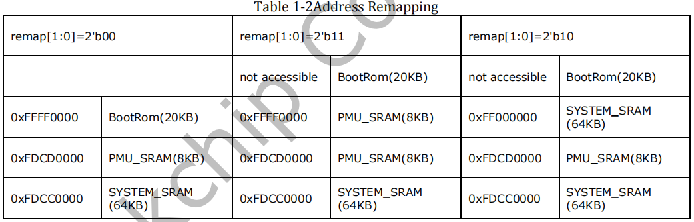

# 环境准备

## alpha开发板启动方式

+ 01xxxxxx

  串行下载，可以通过USB烧写镜像文件

+ 10000010

  sd卡启动

+ 10100110

  emmc启动

+ 10001001

  nand flash 启动

## VMware 共享文件夹

+ VMware设置：

​	Workstation ->  虚拟机 -> 设置 -> 选项 -> 共享文件夹 -> 总是启用 -> 选择想共享的文件夹

+ 虚拟机操作：

```bash
$ vmware-hgfsclient # 启动共享服务
$ mkdir win_share   # 自己创建共享文件夹(不用/mnt/hgfs)
$ vmhgfs-fuse .host:/  win_share  # 挂载共享目录
$ ls win_share # 看到共享的内容，表示成功
```

## NFS、SSH、TFTP 服务开启

+ nfs

```bash
sudo apt-get install nfs-kernel-server rpcbind # 安装服务
sudo vi /etc/exports # 配置NFS服务
# 添加语句 /home/pdg/share/nfs_share *(rw,sync,no_root_squash)
sudo /etc/init.d/nfs-kernel-server restart # 重启服务
```

```bash
# 如果uboot下载失败，可能是因为版本兼容问题
sudo vim /etc/default/nfs-kernel-server
# 更改里面的内容 RPCNFSDCOUNT="-V 2 8"
sudo vim /etc/nfs.conf
# 更改里面的内容 udp=y tcp=y vers2=y
sudo ufw disable # 关闭防火墙
sudo /etc/init.d/nfs-kernel-server restart # 重启nfs server
```

+ ssh

```bash
sudo apt-get install openssh-server
```

+ tftp

```bash
sudo apt-get install tftp-hpa tftpd-hpa
sudo apt-get install xinetd
```

## 文件解压

```bash
tar  	-zxvf	xxx.tar.gz
tar  	-jxvf  	xxx.tar.bz2
tar 	-xvf 	xxx.tar.xz
```

## 烧录SD卡

```bash 
imxdownload u-boot.bin /dev/sdb
```

/dev/sdb 为 sd卡插入虚拟机后出现的设备文件

# SoC 启动流程

## RK3568 启动流程

### 芯片如何加载bootloader

+ 芯片上电，CPU启动地址为 0xFFFF0000，执行映射到该地址的程序
  + 如果为默认情况，执行SoC出厂烧录的片上 BootRom
    + 初始化硬件，依次检查 SPI Nor Flash、SPI Nand Flash、external Nand Flash、external eMMC Flash、external SDMMC card，是否有启动程序
    + 如果中间检查到 存在启动程序
      + 加载 SDRAM初始化程序 到 SYSTEM_SRAM
      + 运行启动程序以初始化DDR
      + 传输启动程序到DDR
      + 继续运行启动程序
    + 如果一直没有检查到启动程序
      + 初始化USB
      + 下载DDR初始化程序，并以此初始化DDR
      + 下载启动代码到DDR，运行启动代码
  + 如果不是默认情况，执行 PMU_SRAM 或者 SYSTEM_SRAM 的程序

### 芯片启动配置

芯片上电时的地址映射关系，由 PMU_SGRF_SOC_CON1[12:11] 的两位比特控制。



+ BootRom：SoC厂商烧录的代码，默认启动时执行
+ PMU_SRAM：SoC芯片内部集成的 RAM

+ SYSTEM_SRAM：SoC芯片内部集成的 RAM


## IMX6ULL 启动流程


# uboot 操作

## uboot 编译

### 编译过程

编译脚本：mx6ull_14x14_emmc.sh

```bash
#!/bin/bash
make ARCH=arm CROSS_COMPILE=arm-linux-gnueabihf- distclean
make ARCH=arm CROSS_COMPILE=arm-linux-gnueabihf- mx6ull_14x14_evk_emmc_defconfig
make V=1 ARCH=arm CROSS_COMPILE=arm-linux-gnueabihf- -j16
```

+ 指定参数 AECH=arm
+ 指定交叉编译器 CROSS_COMPILE=arm-linux-gnueabihf-
+ 指定编译配置文件 mx6ull_14x14_evk_emmc_defconfig （位于configs目录下）


u-boot.bin 就是编译出来的 uboot 二进制文件。uboot是个裸机程序，因此需要在其前面加上头部(IVT、DCD等数据)才能在I.MX6ULL上执行。 

u-boot.imx 文件就是添加头部以后的 u-boot.bin，u-boot.imx 就是我们最终要烧写到开发板中的 uboot 镜像文件。

### 编译配置

make 命令 后面加上配置文件名时，会把configs文件夹下的对应文件拷贝到当前目录的  .config 文件


## alpha 开发板移植uboot

添加配置文件 mx6ull_alientek_emmc_defconfig

添加头文件 include/configs/mx6ull_alientek_emmc.h

添加开发板对应的板级文件夹 board/freescale/mx6ull_alientek_emmc

添加源文件 board/freescale/mx6ull_alientek_emmc/mx6ull_alientek_emmc.c

修改mx6ull_alientek_emmc下的Makefile、imximage.cfg、Kconfig、MAINTAINERS文件

修改uboot图形界面配置文件 arch/arm/cpu/armv7/mx6/Kconfig

修改mx6ull_alientek_emmc.h 和 mx6ull_alientek_emmc.c 文件内的LCD、网卡驱动、打印信息等。


## debug 调试

### 调试手段

+ 调试日志与打印

  在 include/log.h 中 定义 DEBUG 宏，重新编译u-boot打开日志。

  在源码中添加 debug 、 printf 、 puts 等函数添加日志跟踪。

+ 符号与地址映射

  查看文件 u-boot.map ，查看符号、地址、源码 的对应信息。

+ 添加自定义命令

  在源码中 cmd/boot.c 目录中添加源码，可以添加自定义命令。

### 常见问题

+ 编译与内存加载地址错误，导致程序无法执行

  不同板子在编译或者加载uboot的时候，其地址是不同的，需要看手册替换。 

+ 未关闭cache和中断，导致程序卡死或出错

  某些程序执行时，如果未关闭cache或中断，会导致许多问题。

+ 烧写的文件过大，导致烧录不成功

  打开DEBUG，添加代码等行为都会导致bin大小变大。如果大于分区限制，会导致烧写不成功。需要更换文件，重新上电后烧录。


## uboot使用

### uboot 基础命令

uboot中的数值都是16进制（省略0x前缀）

[.b .w .l]对应 byte、word 和 long，也就是分别以 1 个字节、2 个字节、4 个字节

+ 查询命令：? + (命令名) 或者 help + (变量名)
+ 环境变量相关：printenv + [变量名]、setenv  + (变量名) + [数值]、saveenv
+ 复位重启：reset
+ 跳转执行：go + (程序地址) + [参数列表]
+ 把环境变量当命令执行：run + (环境变量名)

### uboot 内存命令

+ 内存读取(数值为16进制)：md[.b,.w,.l] + (地址) + [长度]
+ 修改内存（地址不自增）：nm[.b,.w,.l] + (地址)，输入内存数值，按q退出
+ 修改内存（地址自增）：mm[.b,.w,.l] + (地址)，输入内存数值，按q退出

+ 填充内存：mw[.b,.w,.l] + (地址)+ (填充值) + [长度]
+ 拷贝内存：cp [.b, .w, .l]  + (源地址) + (目标地址) + (长度)
+ 比较内存：cmp [.b, .w, .l] + (地址1) + (地址2) + (长度)

### uboot MMC命令

emmc 、SD卡都是 MMC 设备，MMC设备内部有分区。

千万不能写SD卡或者EMMC前面两个块，里面保存着分区表。

一个块为512bytes大小。

+ 查看当前存在的mmc设备： mmc list
+ 重新扫描当前存在的mmc设备：mmc rescan
+ 获取当前mmc设备信息：mmc info
+ 获取当前mmc设备分区信息： mmc part
+ 切换设备： mmc dev (设备号) [分区号]，如 mmc dev 1 2
+ 从mmc读取到内存： mmc read (内存地址)  (块编号)  (块个数)
+ 内存写入mmc： mmc write (内存地址)  (块编号)  (块个数)
+ 擦除mmc： mmc erase (块编号)  (块个数)

### uboot 文件系统命令

mmc存储设备中可能会以fat格式存储文件，这时候可以使用fat相关命令。

命令中的 (接口) 常用 mmc 代替。

+ 查询分区中的文件系统信息： fatinfo (接口)  [设备号:分区号]

+ 查看分区中的文件： ls (接口) [设备号:分区号]
+ 查看分区中的文件系统格式： fstype (接口) [设备号:分区号]
+ 读取文件到内存： fatload (接口) [设备号[:分区] [内存地址 [文件名[字节数 [偏移]]]]]。如果字节数为0或者省略的话，代表读取整个文件。

### uboot 网络基本配置

```txt
setenv ipaddr 192.168.1.50
setenv ethaddr 00:04:9f:04:d2:35
setenv gatewayip 192.168.1.1
setenv netmask 255.255.255.0
setenv serverip 192.168.1.101
saveenv
```

+ setenv serverip 使用ubuntu 虚拟机IP地址
+ uboot 可以使用 ping 命令测试网络，但不会响应ping 请求，所以不能用虚拟机ping开发板

### uboot 下载虚拟机文件

```txt
nfs 80800000 192.168.1.101:/home/pdg/share/nfs_share/zImage
```

+ 使用 nfs 命令来将 zImage 下载到开发板 DRAM 的 0X80800000 地址处

### uboot 挂载根文件系统

uboot 里面的 bootargs 环境变量会设置“root”的值，所以我们将 root 的值改为 NFS 挂载即可。

挂载之后相当于共享文件夹，可以用来相互传递文件。

在 Linux 内核源码里面有相应的文档讲解如何设置，文档为 Documentation/filesystems/nfs/nfsroot.txt，格式如下：

```bash
root=/dev/nfs nfsroot=[<server-ip>:]<root-dir>[,<nfs-options>] ip=<client-ip>:<server-ip>:<gwip>:<netmask>:<hostname>:<device>:<autoconf>:<dns0-ip>:<dns1-ip>
```

+ server-ip：服务器 IP 地址，也就是存放根文件系统主机的 IP 地址。

+ root-dir：根文件系统的存放路径，比如我的就是/home/zuozhongkai/linux/nfs/rootfs。

+ nfs-options：NFS 的其他可选选项，一般不设置。“proto=tcp”表示使用 TCP 协议，“rw”表示 nfs 挂载的根文件系统为可读可写。

+ client-ip：设置客户端 IP 地址，也就是我们开发板的 IP 地址，Linux 内核启动以后就会使用此 IP 地址来配置开发板。此地址一定要和 Ubuntu 主机在同一个网段内，并且没有被其他的设备使用。

+ server-ip：服务器 IP 地址。

+ gw-ip：网关地址。

+ netmask：子网掩码，通常为 255.255.255.0。

+ hostname：客户机的名字，一般不设置，此值可以空着。

+ device：设备名，也就是网卡名，一般是 eth0，eth1….，正点原子的 I.MX6U-ALPHA 开发板的 ENET2 为 eth0，ENET1 为 eth1。如果我们使用 ENET2，所以网卡名就是 eth0。

+ autoconf：自动配置，一般不使用，所以设置为 off。

+ dns0-ip：DNS0 服务器 IP 地址，不使用。

+ dns1-ip：DNS1 服务器 IP 地址，不使用。

```bash
setenv bootargs 'console=ttymxc0,115200 root=/dev/nfs nfsroot=192.168.1.104:/home/pdg/share/nfs_share/rootfs,proto=tcp,nfsvers=3 rw ip=192.168.1.103:192.168.1.104:192.168.1.1:255.255.255.0::eth0:off'
```

### 启动linux

bootz、bootm、boot 命令用于启动zImage文件。

```txt
bootz [addr [initrd[:size]] [fdt]]
bootm [addr [initrd[:size]] [fdt]]
```

 bootz 、bootm 命令有三个参数

+ addr 是 Linux 镜像文件在 DRAM 中的位置
+ initrd 是 initrd文件在DRAM 中的地址，如果不使用的话使用‘-’代替即可
+ fdt 就是设备树文件在 DRAM 中的地址。

boot命令会读取环境变量 bootcmd 来启动 Linux 系统。

```txt
setenv bootcmd 'tftp 80800000 zImage; tftp 83000000 imx6ull-alientek-emmc.dtb; bootz 80800000 - 83000000'
saveenv
boot
```

+ 内核镜像和设备树可以通过 网络(nfs tftp) 或 存储器(fatload) 来拷贝到内存。


```txt
setenv bootcmd 'nfs 80800000 192.168.1.101:/home/pdg/share/nfs_share/zImage; nfs 83000000 192.168.1.101:/home/pdg/share/nfs_share/mx6ull_alientek_emmc.dtb; bootz 80800000 - 83000000'
saveenv 
boot
```


# uboot 相关知识

## 启动阶段

U-BOOT分为两个阶段，第一阶段是(~/cpu/xxx/start.S中)在非易失存储器(如 flash)上运行，完成对硬件的初始化，包括看门狗，中断缓存等，并且负责把代码搬移到RAM中(在搬移的时候检查自身代码是否在RAM中)，然后完成C程序运行所需要环境的建立，包括堆栈的初始化等,最后执行一句跳转指令到 _start_armboot，进入第二阶段。

## 链接与地址运行

在顶层的Makefile文件中（约160行），因为-Ttext $(TEXT_BASE)命令的使用,链接器把UBOOT从地址 TEXT_BASE 开始链接。

在第一阶段中，所有使用的目标地址寻址都是使用当前PC值加减偏移量的方法。所以把UBOOT烧写到0地址开始的FLASH中，导致代码所在地址不是链接指定的地址，也不会影响第一阶段的正确执行。

uboot 会把自己拷贝到链接地址指定的内存位置上去，此时代码在内存中的实际位置 等于 代码链接时确定的位置，所以第二阶段的代码可以使用绝对寻址方式执行。 

## 内存布局

uboot 源文件： common/board_f.c

执行函数： board_init_f

静态全局变量：init_sequence_f

init_sequence_f 定义了一系列 初始化函数。uboot编译时使用各种配置宏来裁剪函数列表。在初始化执行 board_init_f 时，函数列表 init_sequence_f 中的函数会一一执行。在这个过程中会设置指针、确定内存布局，相关地址设置保存进了gd结构体。

后续 执行汇编函数 relocate_code，会根据 gd 结构体中的设置，把自身代码拷贝到目的地址。

# linux

## linux编译

### 编译过程

编译脚本：imx_v7_defconfig.sh

```bash
#!/bin/sh
make ARCH=arm CROSS_COMPILE=arm-linux-gnueabihf- distclean
make ARCH=arm CROSS_COMPILE=arm-linux-gnueabihf- imx_v7_defconfig
# make ARCH=arm CROSS_COMPILE=arm-linux-gnueabihf- menuconfig
make ARCH=arm CROSS_COMPILE=arm-linux-gnueabihf- all -j16
```

+ 指定架构 AECH=arm
+ 指定交叉编译器 CROSS_COMPILE=arm-linux-gnueabihf-
+ 指定编译配置文件 imx_v7_defconfig （位于arch/arm/configs目录下）


### 关键选项

编译时需要指定 ARCH 和 CROSS_COMPILE，否则则读取环境变量

```makefile
ARCH ?= $(SUBARCH)
CROSS_COMPILE ?= $(CONFIG_CROSS_COMPILE:"%"=%)
```

### 其他选项

使用选项 “ V=1” 可以打印更多信息。

使用选项 “ O=output” 可以把过程文件输出到指定目录。

使用选项 “ M=dir” 或者 "SUBDIRS=dir" 可以单独编译某个模块。

### 关键过程

+ 设置基础信息，如目标架构、编译器等等
+ 读取scripts/
+ 设置头文件路径，导出变量，传递给其他Makefile使用
+ 目标 "%config" 
+ 目标 "%_defconfig"

make 的过程，重点就是将各个子目录下的 built-in.o、.a 等文件链接在一起，最终生成 vmlinux 这个 ELF 格式的可执行文件。链接脚本为 arch/arm/kernel/vmlinux.lds，链接过程是由shell脚本scripts/link-vmlinux.s来完成的

### 输出文件

+ vmlinux 是编译出来的最原始的内核文件，大小大概有16MB。

+ Image 是 Linux 内核镜像文件，Image 就是使用 objcopy 取消掉 vmlinux 中的一些其他信息，比如符号表。Image 保存在 arch/arm/boot 目录下，其大小大概在 12MB

+ zImage 是经过 gzip 压缩后的 Image，经过压缩以后其大小大概在 6MB 左右。
+ uImage 是老版本 uboot 专用的镜像文件，uImag 是在 zImage 前面加了一个长度为 64字节的“头”，这个头信息描述了该镜像文件的类型、加载位置、生成时间、大小等信息。
+ *.dtb 设备树文件  保存在 arch/arm/boot/dts/目录下

新的uboot支持zImage启动，但是老的uboot可能还是需要使用uImage启动。


## 设备树编译

内核编译的时候会同时编译设备树，如果要单独编译某个设备树，需要以下步骤：

1. 打开目录 arch/arm/boot/dts/ 确保设备树文件存在
2. 编辑目录 arch/arm/boot/dts/ 下的 Makefile，在变量 dtb-$(CONFIG_SOC_IMX6ULL) 下添加与dts文件对应的dtb文件名：  imx6ull-alientek-emmc.dtb
3. 回到根目录，执行语句如下：

```shell
make ARCH=arm CROSS_COMPILE=arm-linux-gnueabihf- imx6ull-alientek-emmc.dtb
```


## linux启动过程

根据链接脚本 arch/arm/kernel/vmlinux.lds，找到linux入口函数 ENTRY(stext)。

启动时要求：

1. MMU关闭
2. D-cache关闭，I-cache无所谓
3. r0寄存器为 0 
4. r1寄存器为 机器ID 
5. r2寄存器为 设备树dtb地址 或者 atags

### stext函数

stext函数位于 arch/arm/ kernel/head.S。

stext函数为链接脚本指定的入口函数，该函数最后会启动C语言函数 start_kernel。

在调用start_kernel之前，一直为汇编语言、通常被称为 linux启动的第一阶段。

函数处理流程：

__vet_stags函数用来验证设备树或者atags是否有效。

__fixup_smp函数是关于多核处理器的处理

__create_page_tables函数用于创建页表

__enable_mmu函数开启MMU

​	->__turn_mmu_on

​		->__mmap_switched

​			->start_kernel （进入C函数，启动内核）

### start_kernel函数

start_kernel函数位于init/main.c文件。

在调用start_kernel之后，通常被称为 linux启动的第二阶段。

```c
asmlinkage __visible void __init start_kernel(void)
{
	char *command_line;
	char *after_dashes;

	/*
	 * lockdep 是死锁检测模块、此函数会初始化两个哈希表，此函数要求尽早执行
	 */
	lockdep_init();
	set_task_stack_end_magic(&init_task); /* 设置任务堆栈魔数，用于检测栈溢出 */
	smp_setup_processor_id(); /* 跟 SMP 有关(多核处理器)，设置处理器 ID。*/
	debug_objects_early_init(); /* 做一些和 debug 有关的初始化 */

	/*
	 * Set up the the initial canary ASAP:
	 */
	boot_init_stack_canary(); /* 栈溢出检测初始化 */

	cgroup_init_early(); /* cgroup 初始化，cgroup 用于控制 Linux 系统资源*/

	local_irq_disable(); /* 关闭当前 CPU 中断 */
	early_boot_irqs_disabled = true;

    /*
     * 关闭中断，期间做一些重要的操作，然后打开中断
     */
	boot_cpu_init(); /* 跟 CPU 有关的初始化 */
	page_address_init(); /* 页地址相关的初始化 */
	pr_notice("%s", linux_banner); /* 打印 Linux 版本号、编译时间等信息 */
    /*
    	架构相关的初始化，此函数会解析传递进来的 ATAGS 或者设备树(DTB)文件。
    	会根据设备树里面 的 model 和 compatible 这两个属性值来查找 Linux 是否支持这个单板。
    	此函数也会获取设备树中 chosen 节点下的 bootargs 属性值来得到命令行参数，
    	也就是 uboot 中的 bootargs 环境变量的值，获取到的命令行参数会保存到command_line 中。
 	*/
	setup_arch(&command_line);
	mm_init_cpumask(&init_mm);
	setup_command_line(command_line); /* 存储命令行参数 */
	setup_nr_cpu_ids(); /* 如果只是 SMP(多核 CPU)的话，此函数用于获取CPU 核心数量 */
	setup_per_cpu_areas(); /* 在 SMP 系统中有用，设置每个 CPU 的 per-cpu 数据 */
	smp_prepare_boot_cpu();	/* arch-specific boot-cpu hooks */

	build_all_zonelists(NULL, NULL); /* 建立系统内存页区(zone)链表 */
	page_alloc_init(); /* 处理用于热插拔 CPU 的页 */

	pr_notice("Kernel command line: %s\n", boot_command_line); /* 打印命令行信息 */
	parse_early_param(); /* 解析命令行中的 console 参数 */
	after_dashes = parse_args("Booting kernel",
				  static_command_line, __start___param,
				  __stop___param - __start___param,
				  -1, -1, &unknown_bootoption);
	if (!IS_ERR_OR_NULL(after_dashes))
		parse_args("Setting init args", after_dashes, NULL, 0, -1, -1,
			   set_init_arg);

	jump_label_init();

	/*
	 * These use large bootmem allocations and must precede
	 * kmem_cache_init()
	 */
	setup_log_buf(0); /* 设置 log 使用的缓冲区*/
	pidhash_init(); /* 构建 PID 哈希表，通过构建哈希表可以快速搜索进程信息结构体。*/
	vfs_caches_init_early(); /* 预先初始化 vfs(虚拟文件系统)的目录项和索引节点缓存 */
	sort_main_extable(); /* 定义内核异常列表 */
	trap_init(); /* 完成对系统保留中断向量的初始化 */
	mm_init(); /* 内存管理初始化 */

	sched_init(); /* 初始化调度器，主要是初始化一些结构体 */
	preempt_disable(); /* 关闭优先级抢占 */
    
    /* 检查中断是否关闭，如果没有的话就关闭中断 */
	if (WARN(!irqs_disabled(),
		 "Interrupts were enabled *very* early, fixing it\n"))
		local_irq_disable();
	/* IDR 是 Linux 内核的整数管理机制，也就是将一个整数 ID 与一个指针关联起来。 */
    idr_init_cache();
    /* 初始化 RCU，RCU 全称为 Read Copy Update(读-拷贝-更新) */
	rcu_init();

	trace_init(); /* 跟踪调试相关初始化，之后可以使用trace_printk()  */

	context_tracking_init();
	radix_tree_init();
	/* 
    	初始中断相关初始化,主要是注册 irq_desc 结构体变量
		因为 Linux 内核使用 irq_desc 来描述一个中断。
	*/
	early_irq_init(); 
	init_IRQ(); /* 中断初始化 */
	tick_init(); /* tick 初始化 */
	rcu_init_nohz();
	init_timers(); /* 初始化定时器 */
	hrtimers_init(); /* 初始化高精度定时器 */
	softirq_init(); /* 软中断初始化 */
	timekeeping_init();
	time_init(); /* 初始化系统时间 */
	sched_clock_postinit();
	perf_event_init();
	profile_init();
	call_function_init();
	WARN(!irqs_disabled(), "Interrupts were enabled early\n");
	early_boot_irqs_disabled = false;
	local_irq_enable(); /* 使能中断 */

	kmem_cache_init_late(); /* slab 初始化，slab 是 Linux 内存分配器 */

    /* 
    初始化控制台，之前 printk 打印的信息都存放缓冲区中，并没有打印出来。
    只有调用此函数初始化控制台以后才能在控制台上打印信息。
    */
	console_init();
	if (panic_later)
		panic("Too many boot %s vars at `%s'", panic_later,
		      panic_param);

	lockdep_info();

	/*
	 * Need to run this when irqs are enabled, because it wants
	 * to self-test [hard/soft]-irqs on/off lock inversion bugs
	 * too:
	 */
	locking_selftest();

    /*
     * 中间省略一大段函数调用。
     */

	/* Do the rest non-__init'ed, we're now alive */
	rest_init(); /* 剩下的初始化 */
}
```

### rest_init 函数

```c
static noinline void __init_refok rest_init(void)
{
	int pid;

	rcu_scheduler_starting(); /* 启动RCU锁调度器 */
	smpboot_thread_init();
    /*
    调用函数 kernel_thread 创建 kernel_init 内核进程（PID=1）。
	init 进程一开始是内核进程(也就是运行在内核态)
	后面 init 进程会在根文件系统中查找名“init”这个程序，这个“init”程序处于用户态
	通过运行这个“init”程序，init 进程就会实现从内核态到用户态的转变。
    */
	kernel_thread(kernel_init, NULL, CLONE_FS);
	numa_default_policy();
    /*
    调用函数 kernel_thread 创建 kthreadd 内核进程（PID=2）。
    kthreadd 进程负责所有内核进程的调度和管理。
    */
	pid = kernel_thread(kthreadd, NULL, CLONE_FS | CLONE_FILES);
	rcu_read_lock();
	kthreadd_task = find_task_by_pid_ns(pid, &init_pid_ns);
	rcu_read_unlock();
	complete(&kthreadd_done);

	/*
	 * The boot idle thread must execute schedule()
	 * at least once to get things moving:
	 */
	init_idle_bootup_task(current);
	schedule_preempt_disabled();
    /*
    最后调用函数 cpu_startup_entry 来进入 idle 进程（PID=0）
    cpu_startup_entry 会调用 cpu_idle_loop（wihle死循环）
    */
	/* Call into cpu_idle with preempt disabled */
	cpu_startup_entry(CPUHP_ONLINE);
}
```

### 启动init进程

kernel_init 函数就是 init 进程具体做的工作，定义在文件 init/main.c 中。

init进程会调用kernel_init_freeable，初始化驱动、构建根文件系统。

然后根据uboot传入的参数，或者根文件系统内的默认配置文件，执行用户空间的init程序。

```c
static int __ref kernel_init(void *unused)
{
	int ret;

	kernel_init_freeable(); /* init 进程的一些其他初始化工作 */
	/* need to finish all async __init code before freeing the memory */
	async_synchronize_full(); /* 等待所有的异步调用执行完成 */
	free_initmem(); /* 释放 init 段内存 */
	mark_rodata_ro();
	system_state = SYSTEM_RUNNING; /* 标记系统正在运行 */
	numa_default_policy();

	flush_delayed_fput();
	/*
	ramdisk_execute_command 是一个全局的 char 指针变量
	此变量值为“/init”，也就是根目录下的 init 程序。
	ramdisk_execute_command 也可以通过 uboot 传递
	在 bootargs 中使用“rdinit=xxx”即可xxx 为具体的 init 程序名字。
	*/
	if (ramdisk_execute_command) {
		ret = run_init_process(ramdisk_execute_command);
		if (!ret)
			return 0;
		pr_err("Failed to execute %s (error %d)\n",
		       ramdisk_execute_command, ret);
	}

	/*
    如果 ramdisk_execute_command 为空的话就看 execute_command 是否为空
    execute_command 的值是通过 uboot 传递，在 bootargs 中使用“init=xxxx”就可以了
    比如“init=/linuxrc”表示根文件系统中的 linuxrc 就是要执行的用户空间 init 程序。
	 */
	if (execute_command) {
		ret = run_init_process(execute_command);
		if (!ret)
			return 0;
		panic("Requested init %s failed (error %d).",
		      execute_command, ret);
	}
    /*
    如果 ramdisk_execute_command 和 execute_command 都为空，
    那么就依次查找“/sbin/init”、“/etc/init”、“/bin/init”和“/bin/sh”
	这四个相当于备用 init 程序，如果这四个也不存在，那么 Linux 启动失败！
    */
	if (!try_to_run_init_process("/sbin/init") ||
	    !try_to_run_init_process("/etc/init") ||
	    !try_to_run_init_process("/bin/init") ||
	    !try_to_run_init_process("/bin/sh"))
		return 0; /* 成功启动 */

	panic("No working init found.  Try passing init= option to kernel. "
	      "See Linux Documentation/init.txt for guidance.");
}
```

### kernel_init_freeable函数

初始化驱动子系统。

开启文件描述符0 1 2并定向到控制台设备 /dev/console。

读取uboot环境变量bootargs，挂载根文件系统。

```c
static noinline void __init kernel_init_freeable(void)
{
	/* 等待 kthreadd 进程准备就绪 */
	wait_for_completion(&kthreadd_done);
	/*
	 * 中间省略一大段函数 
	 */
	smp_init();	/* SMP初始化 */
	sched_init_smp(); /* 多核SMP初始化 */
	
    /*
    设备驱动初始化都在此函数中完成！
	会调用driver_init函数完成 Linux 下驱动模型子系统的初始化
	*/
	do_basic_setup();

	/*
	打开设备“/dev/console”，此文件为控制台设备。
	每个文件都有一个文件描述符，此处打开的“/dev/console” 文件描述符为 0，作为标准输入。
	*/
	if (sys_open((const char __user *) "/dev/console", O_RDWR, 0) < 0)
		pr_err("Warning: unable to open an initial console.\n");
	/*
	sys_dup 函数将标准输入(0)的文件描述符复制了 2 次
	一个作为标准输出(1)，一个作为标准错误(2)。
	这样标准输入、输出、错误都是/dev/console 了。
	*/
	(void) sys_dup(0);
	(void) sys_dup(0);
	/*
	 * check if there is an early userspace init.  If yes, let it do all
	 * the work
	 */

	if (!ramdisk_execute_command)
		ramdisk_execute_command = "/init";

	if (sys_access((const char __user *) ramdisk_execute_command, 0) != 0) {
		ramdisk_execute_command = NULL;
		prepare_namespace(); /* 挂载根文件系统，由 uboot 的 bootargs 环境变量指定 */
	}

	/*
	 * Ok, we have completed the initial bootup, and
	 * we're essentially up and running. Get rid of the
	 * initmem segments and start the user-mode stuff..
	 *
	 * rootfs is available now, try loading the public keys
	 * and default modules
	 */

	integrity_load_keys();
	load_default_modules();
}
```

## 开发板移植linux

添加默认配置文件 arch/arm/configs/ imx_alientek_emmc_defconfig

添加设备树文件 arch/arm/boot/dts/imx6ull-alientek-emmc.dts

修改设备树Makefile  arch/arm/boot/dts/Makefile

>tar.bz2 文件 需要在 linux下使用  tar -jxvf 解压，在windows 下使用360解压会出错 

## linux 与机器的匹配检查

在没有使用设备树之前，uboot会向linux内核传递一个machine id 的值，linux会根据machine id 判断是否支持该机器。

使用设备树之后，linux 根据设备树根节点下的 compatible 属性来判断是否支持该机器。

不管是哪一种方式，linux内核都会使用 struct machine_desc 来描述机器。linux内核中会维护支持的机器信息，内核代码中使用宏来定义 struct machine_desc 结构体。使用设备ID的结构体 使用 MACHINE_START 和 MACHINE_END 宏，使用设备树的结构体 使用 DT_MACHINE_START 和 MACHINE_END 宏。

```c
/*
 * Set of macros to define architecture features.  This is built into
 * a table by the linker.
 */
#define MACHINE_START(_type,_name)			\
static const struct machine_desc __mach_desc_##_type	\
 __used							\
 __attribute__((__section__(".arch.info.init"))) = {	\
	.nr		= MACH_TYPE_##_type,		\
	.name		= _name,

#define MACHINE_END				\
};

#define DT_MACHINE_START(_name, _namestr)		\
static const struct machine_desc __mach_desc_##_name	\
 __used							\
 __attribute__((__section__(".arch.info.init"))) = {	\
	.nr		= ~0,				\
	.name		= _namestr,

```

 

# 根文件系统

根文件系统使用 busybox1.29.0

## busybox中文字符支持

libbb/printable_string.c: printable_string函数

libbb/unicode.c: unicode_conv_to_printable2函数

去掉 c >= 0x7f 时的特殊处理。

## 构建根文件系统

my_make.sh

````bash
#!/bin/bash
export ARCH=arm
export CROSS_COMPILE=arm-linux-gnueabihf-

OUT_DIR=../busybox-output  # 设定根文件系统 输出的目录
if [ -d ${OUT_DIR} ];then
    rm -rf ${OUT_DIR}
fi
mkdir ${OUT_DIR}

make clean
make defconfig
make menuconfig
make
make install CONFIG_PREFIX=${OUT_DIR}
````

## 文件系统完善

### 完善根目录

创建文件夹 dev、proc、mnt、sys、tmp 和 root 等。

### 添加库文件

创建/lib文件夹，拷贝交叉编译器中安装目录下 arm-linux-gnueabihf/libc/lib 和arm-linux-gnueabihf/lib 中的库文件。

创建/usr/lib文件夹，拷贝交叉编译器中安装目录下 arm-linux-gnueabihf/libc/usr/lib 中的库文件。

### 添加启动脚本

创建/etc/init.d/rcS文件，并**赋予可执行权限**

```bash
#!/bin/sh
PATH=/sbin:/bin:/usr/sbin:/usr/bin:$PATH
LD_LIBRARY_PATH=$LD_LIBRARY_PATH:/lib:/usr/lib
export PATH LD_LIBRARY_PATH  # 导出环境变量
mount -a # 使用 mount 命令来挂载所有的文件系统，这些文件系统由文件/etc/fstab 来指定
mkdir /dev/pts # 创建目录/dev/pts
mount -t devpts devpts /dev/pts # 将 devpts 挂载到/dev/pts 目录中
# 使用 mdev 来管理热插拔设备
# 通过这两行，Linux 内核就可以在/dev 目录下自动创建设备节点
# 关于 mdev 的详细内容可以参考 busybox 中的 docs/mdev.txt 文档。
echo /sbin/mdev > /proc/sys/kernel/hotplug
mdev -s
```

创建/etc/fstab文件，指定挂载的文件系统

```bash
# 格式 <file system> <mount point> <type> <options> <dump> <pass>
proc /proc proc defaults 0 0
tmpfs /tmp tmpfs defaults 0 0
sysfs /sys sysfs defaults 0 0
```

创建/etc/inittab文件

```bash
# 格式 <id>:<runlevels>:<action>:<process>
::sysinit:/etc/init.d/rcS  		# 系统启动后运行 rcS 脚本
console::askfirst:-/bin/sh 		# 将 console 作为控制台终端，也就是 ttymxc0
::restart:/sbin/init			# 重启时运行 init 命令
::ctrlaltdel:/sbin/reboot       # 按下 ctrl+alt+del 组合键时重启
::shutdown:/bin/umount -a -r    # 关机时卸载各个文件系统
::shutdown:/sbin/swapoff -a     # 关机时关闭交换分区
```

inittab 的详细内容可以参考 busybox 下的文件 examples/inittab。init 程序会读取/etc/inittab 这个文件，inittab 由若干条指令组成。每条指令的结构都是一样的，由以“:”分隔的 4 个段组成

+ id：每个指令的标识符，不能重复。但是对于 busybox 的 init 来说，id有着特殊意义。对于 busybox 而言id用来指定启动进程的控制 tty，一般我们将串口或者 LCD 屏幕设置为控制 tty。

+ runlevels：对 busybox 来说此项完全没用，所以空着。

+ action：动作，用于指定process可能用到的动作。busybox 支持的动作如表：
  + sysinit :在系统初始化的时候 process 才会执行一次。
  + respawn :当 process 终止以后马上启动一个新的。
  + askfirst :和 respawn 类似，在运行 process 之前在控制台上显示“Please press Enter to activate this console.”。只要用户按下“Enter”键以后才会执行 process。
  + wait :告诉 init，要等待相应的进程执行完以后才能继续执行。
  + once :仅执行一次，而且不会等待 process 执行完成。
  + restart :当 init 重启的时候才会执行 process。
  + ctrlaltdel :当按下 ctrl+alt+del 组合键才会执行 process。
  + shutdown 关机的时候执行 process。
+ process：具体的动作，比如程序、脚本或命令等

 